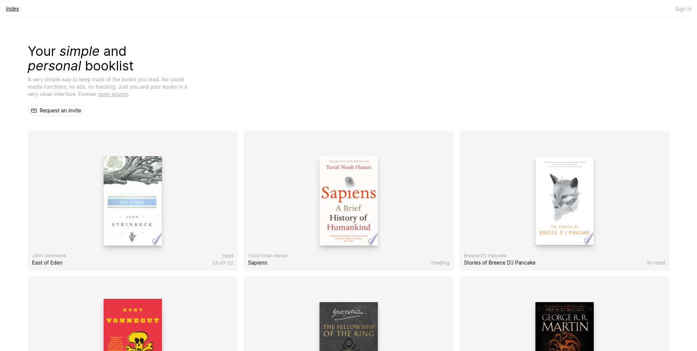

# bklst

Simple app to keep track of books you want to read, are currently reading, or have already read. All with a nice and simple UI. Books are fetched from the [Google Books API](https://developers.google.com/books).

## Dev

- populate the `.env` file with the info in `.env.example`
- `supabase start` to start the db
- `npm install && npm run dev` in another terminal to start the app
