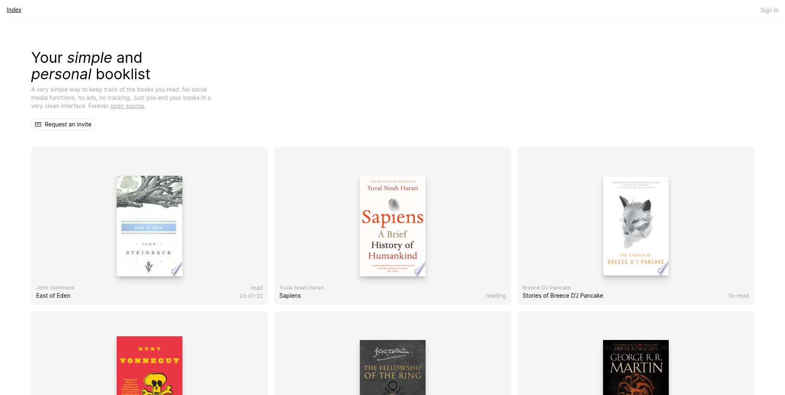

# Bklst

React SPA to keep track of books you want to read, are currently reading, or have already read. All with a nice and simple UI. Books are fetched from the [Google Books API](https://developers.google.com/books).

If you want to try it out, you [send me an email via the Homepage button](bklst.matteotagliatti.it).
